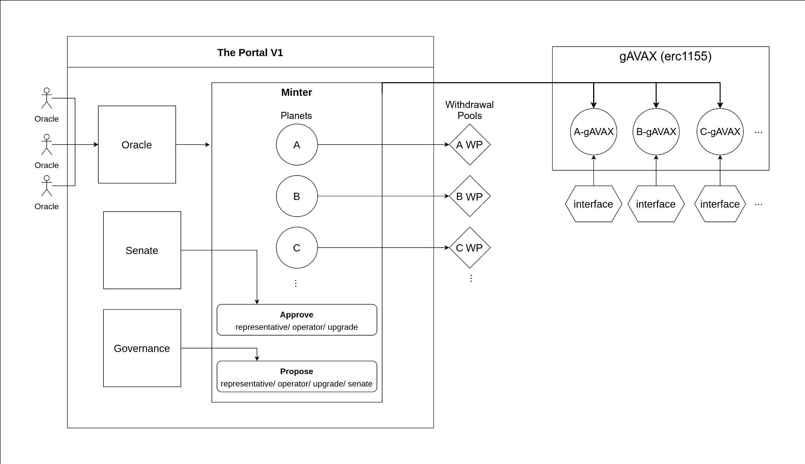
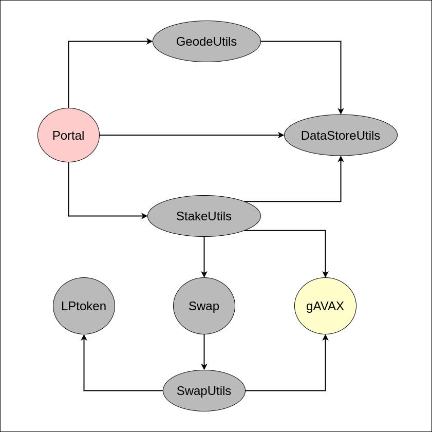

# Decentralized & Trustless Protocol Owned Liquid Staking Derivatives

> To see the changes made after the first audit please refer to this [CHANGELOG](./docs/CHANGELOG.md)

# Contracts

Before starting to review the contracts please take a look at [geode white paper](https://github.com/Geodefi/white_paper/blob/main/geode_whitepaper.pdf) and [initial draft for the dynamic withdrawals](https://docs.google.com/document/d/1ptMrImHonYyXbqAxuhYR0H-LEk07Vaj132SNFoJeCnw/edit?usp=sharing) implementation.

Following documentation is an initial draft prepared for testing and reviewing phase of the Geode Portal.

## Logic behind the implementation



## Contracts layout



# Understanding the Contracts

Contracts are comprehensively commented. To understand the contracts one by one, we will review them in this order:

1. [Understanding gAVAX](docs/Understanding_gAVAX.md)

   1. ERC1155

   2. gAVAX Interfaces

2. [Understanding Swap.sol](docs/Understanding_Swap.md)

   1. StableSwap Algorithms & SwapUtils.sol

3. [Understanding Portal.sol](docs/Understanding_Portal.md)

   1. DataStoreUtils

   2. GeodeUtils

   3. StakeUtils

   4. Portal

# Starter Pack

1. Clone the repository:

```

git clone https://github.com/Geodefi/Portal-Avax.git

cd Portal-Avax

```

2. Create `.env` file, similar to:

```

RESET_BASE_FEE_PER_GAS= "true"

FORK_MAINNET= "true"

SNOWTRACE_API_KEY =

ACCOUNT_PRIVATE_KEYS= "<array of private keys seperated with `space` character, at least 3>"

```

> you can get an api key for from snowtrace [here](https://snowtrace.io/apis), only used on contract verification, so it is not necessary.

3. Checkout to dev repository

```

git checkout dev

```

4. Build the repository

```

npm i

```

# Extra Hardhat Tasks

## Dev Tasks

### 0. Accounts

```

npx hardhat accounts

```

- returns local addresses. Mostly, we don't use them :)

### 1. Compile

```

npx hardhat compile

```

### 2. Test

1. Test everything

```

npx hardhat test

```

2. Test a folder

```

npx hardhat test ./test/Pools/*

```

3. Test a file

```

npx hardhat test ./test/Pools/lpToken.js

```

### 3. Deploy

1. deploy locally:

```

npx hardhat deploy

```

2. deploy with a mainnet fork

- change `FORK_MAINNET` in your .env to "true"

```

npx hardhat deploy

```

3. deploy with a fuji fork

- change `FORK_FUJI` in your .env to "true"

```

npx hardhat deploy

```

4. deploy to fuji

```

npx hardhat deploy --network fuji

```

### 4. List all details from deployment

Lists all the Planets & Operators, with curent information on fee; maintainer & CONTROLLER addresses; Withdrawal Pool, LPtoken, currentInterface addresses.

Additionally, addresses of Governance and Senate.

```

npx hardhat details --network fuji

```

### 5. Activate Portal

Portal needs to be set as the minter address for the following scripts to work.
Please set the Portal as Minter address, by simply:

```

npx hardhat activatePortal --network fuji

```

## Governance Tasks

- **! please do not forget to add : `--network fuji` or `--network localhost` in the following scripts.**

### 6. Create a Proposal

Creates a proposal with desired parameters.

- requires governance role on the deployed contract

- `type` : defines type such as senate, upgrade, proxyAdminUpgrade, operator, planet

- `controller`: refers to the proposed address as the controller of resulting ID

- `name` : defines id with keccak, unique for every proposal and ID.

- gives max deadline auto: 1 weeks.

```

npx hardhat propose --type planet --controller 0xbabababa57D8418cC282e7847cd71a7eB824A30F --name baba

```

- prints the id of the proposal

### 7. Upgrade Portal's implementation

Deploys the new Portal contract, creates an upgrade request and then approves.

- requires both governance and Senate roles

```
npx hardhat clean
npx hardhat compile
npx hardhat upgradePortal  --network mainnet

```

### 8. Ramp A parameter of Withdrawal Pool of given ID

- new A will be effective in 14 days, which is the min amount

```

npx hardhat rampA --a 100 --id 01102186b7e3b0dda7f022d922f87d2ae9dffe939440e17d7166b89717e96f4c

```

## Senate Tasks

### 9. Approve Proposal

Approves a proposal with given id.

- requires senate role on the deployed contract

- `id` : id of the given proposal to approve (optional)

- `name`: name of the given id (optional)

- one of these params should be given & not both. at the same time.

```

npx hardhat approve --id 01102186b7e3b0dda7f022d922f87d2ae9dffe939440e17d7166b89717e96f4c

```

OR

```

npx hardhat approve --name planetName

```

## User Tasks

- **NOTE : you should provide the private Key of the maintainer of given Planet ID in the `.env` as 3. key of ACCOUNT_PRIVATE_KEYS**

> **following tasks might require different tasks to be run first: such as propose, approve with desired type**

### 1. Approve a Senate Proposal as a Planet maintainer

- `sid` : id of the given proposal senate

- `pid` : id of the planet to vote

```

npx hardhat elect --sid 5848961497861446846071668098908043216307568754054818374826047266201438740021 --pid 113154929644263497304457434162309070072515068775518083141019399877413336431517

```

### 2. Change maintainer of an ID as CONTROLLER

```

npx hardhat maintainerSet --id 01102186b7e3b0dda7f022d922f87d2ae9dffe939440e17d7166b89717e96f4c --m 0xbabababa57D8418cC282e7847cd71a7eB824A30F

```

### 3. Change CONTROLLER of an ID as CONTROLLER

```

npx hardhat controllerSet --id 01102186b7e3b0dda7f022d922f87d2ae9dffe939440e17d7166b89717e96f4c --c 0xbabababa57D8418cC282e7847cd71a7eB824A30F

```

### 4. activatePlanetOperator indefinitely

- `oid` : id of the given operator

- `pid` : id of the planet

```

npx hardhat activateOperator --pid 01102186b7e3b0dda7f022d922f87d2ae9dffe939440e17d7166b89717e96f4c --oid 91630959199093646211198814960682556727534799142799726216648273052625587106474

```

### 5. deactivatePlanetOperator immediately

- `oid` : id of the given operator

- `pid` : id of the planet

```

npx hardhat deactivateOperator --pid 01102186b7e3b0dda7f022d922f87d2ae9dffe939440e17d7166b89717e96f4c --oid 91630959199093646211198814960682556727534799142799726216648273052625587106474

```

### 6. Set a pBank Address from P-chain

- `oid` : id of the given operator

- `pid` : id of the planet that will be used

- `bank` : P chain address that will be responsible of creating validators and delerators while being tracked by Telescope.

```

npx hardhat pBankSet --oid 40531039662654797834915976548300568138790381409100383740683790942209388619086 --pid 01102186b7e3b0dda7f022d922f87d2ae9dffe939440e17d7166b89717e96f4c --bank P-fuji1ev02md0arptrz94qchu2k7sxlkahg2s3un0ahr  --network fuji

```

### 7. Set fee for maintainer

- `id` : id of the given maintainer

- `fee` : fee up to MAX_MAINTAINER_FEE, as 1e10 being 100%.

```

npx hardhat feeSet --id 109107927364149951677623767130832398762960713881438355650708216825266818992800 --fee 500000000

```

---

# Avax Mainnet C-subchain deployment

### Contracts

|     |                            |                                              |
| --- | :------------------------- | :------------------------------------------- |
|    0    |          'gAVAX'           | '0x6026a85e11BD895c934Af02647E8C7b4Ea2D9808' |
|    1    |    'AmplificationUtils'    | '0xBB4C9B63586101c3b816A4437f8E5cEB9400dAA8' |
|    2    |        'SwapUtils'         | '0xCa4E4229a0Aa81A4BF7aBC291f94F34B38726b51' |
|    3    |           'Swap'           | '0xCD8951A040Ce2c2890d3D92Ea4278FF23488B3ac' |
|    4    |         'LPToken'          | '0x71B0CD5c4Db483aE8A09Df0f83F69BAC400dBe8c' |
|    5    | 'ERC20InterfaceUpgradable' | '0x9835c0148F83994d54b3f4626015206868653D20' |
|    6    |      'DataStoreUtils'      | '0xc7332D9AbEF755C42b4dF9d9db09BEEf15F8f9Fb' |
|    7    |        'GeodeUtils'        | '0xB72E3Bacac35Eb5B7d04675945B028cc0A2b85B9' |
|    8    |        'StakeUtils'        | '0x8Ef0bFfD16fF76FF97Fe028817f9B6283835BE8A' |
|    9    |          'Portal'          | '0x4fe8C658f268842445Ae8f95D4D6D8Cfd356a8C8' |
|    9    |  'Portal Implementation'   | '0xcF5162a33b05Bf45020A2f047d28C2E47E93958b' |

### Portal details

> npx hardhat --network mainnet details

GOVERNANCE: 0x1B007c50E78ed35fDFAd395BC41C1DBD8Bb9E385

SENATE: 0x1B007c50E78ed35fDFAd395BC41C1DBD8Bb9E385

SenateExpireTimestamp:, Thu Jun 20 2024 17:02:20 GMT+0300 (GMT+03:00)

{

  gAVAX: '0x6026a85e11BD895c934Af02647E8C7b4Ea2D9808',
  
  DEFAULT_SWAP_POOL: '0xCD8951A040Ce2c2890d3D92Ea4278FF23488B3ac',
  
  DEFAULT_LP_TOKEN: '0x71B0CD5c4Db483aE8A09Df0f83F69BAC400dBe8c',
  
  ORACLE: '0xA30694d32533672EF0B9E2288f2b886AE5F949a2',
  
  DEFAULT_A_: '60',
  
  DEFAULT_FEE_: '4000000',
  
  DEFAULT_ADMIN_FEE_: '5000000000',
  
  FEE_DENOMINATOR_: '10000000000',
  
  PERIOD_PRICE_INCREASE_LIMIT: '20000000',
  
  MAX_MAINTAINER_FEE_: '1000000000'
  
}

### Planets

---

| index | name     | id          | fee: | Maintainer&Controller:                     | Interface:                                        | Withdrawal Pool:                           | Withdrawal Pool Token:                     |
| ----- | -------- | ----------- | ---- | ------------------------------------------ | ------------------------------------------------- | ------------------------------------------ | ------------------------------------------ |
| 0     | YieldYak | 45756385... |  5%  | 0xDcEDF06Fd33E1D7b6eb4b309f779a0e9D3172e44 | ERC20: 0xF7D9281e8e363584973F946201b82ba72C965D27 | 0xa974DE60871907AAFE3A4634766aDb40dF461C16 | 0xA544F63B09369a7D116d53883897E7eD6AAEF1Fc |

**Full IDs**
[
'45756385483164763772015628191198800763712771278583181747295544980036831301432'
]

---

### Operators

| index | name | id          | fee: | Maintainer&Controller:                     | pBank:                                                  |
| ----- | ---- | ----------- | ---- | ------------------------------------------ | ------------------------------------------------------- |
| 0     | Eden | 10910792... |  5%  | 0xa2d67Ff6C0a5B091A7b018de5d9377a3D465Ce64 | 45756385: P-avax1gfev5u7desmpc699x9yt683p09llf605e2z5nq |

**Full IDs**
[
'109107927364149951677623767130832398762960713881438355650708216825266818992800'
]

---

# Notes

## Surya

[Surya is a helper npm package released by ConsenSys](https://github.com/ConsenSys/surya). `graph` is really useful. However, same task can be handled by [Solidity-Visual-Developer](https://marketplace.visualstudio.com/items?itemName=tintinweb.solidity-visual-auditor) extension dynamically with `graph(this)` choice at the top of your code.
